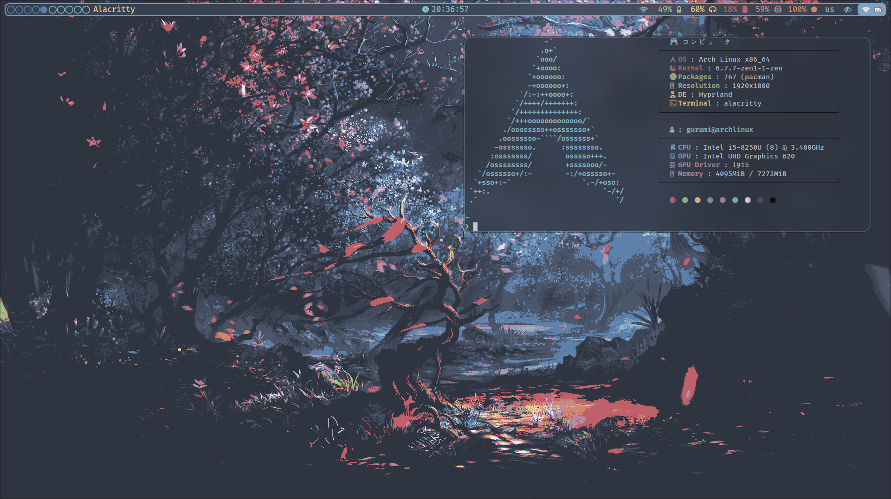
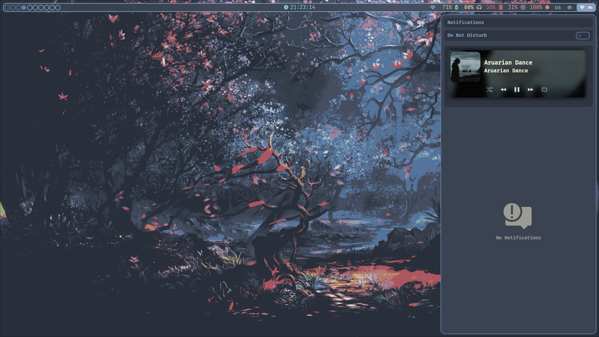

## Introduction
This is my Hyprland setup, following [Nord colorscheme](https://www.nordtheme.com).
Keep in mind, this config is set for Archlinux system, it should work on any Arch based distros, but might work poorly on any other distro. Use it at your own risk!


Before cloning this repo, and using it, make sure you have following packages installed:
```
   hyprland or hyprland-git
   xdg-desktop-portal-hyprland
   wlroots or wlroots-git
   nordic-theme
   papirus-icon-theme
   paprius-nord
   paprius-folders
   ttf-jetbrains-mono
   ttf-font-awesome
   ttf-iosevka
   ttf-firacode
   nerd-fonts
   noto-fonts-emoji
   sddm
   nwg-look
   qt5ct
   kvantum
   gradience
   nautilus
   rofi
   alacritty
   grim
   slurp
   wl-clipboard
   vivaldi or browser of your choice, can be modified in hyprland.conf
   swaync
   swww
   wlogout
   brightnessctl
   hypridle
   hyprlock
   polkit-gnome
   waybar
   cava - optional
```

After installing everything, you can clone, and apply my config:
```
git clone https://github.com/Gurjaka/Dotfiles.git
cd HyprDots
cp -rv .config ~/
```
## Icon Theme:
In order to use nord icon theme you will have to run this command:
```paprius-folders -t Papirus-Dark -C polarnight4```
## Wallpaper
For wallpaper script to work, you will need to create "~/Pictures/wallpapers" directory, and put your wallpapers there.
Recommended [nord wallpapers](https://github.com/Gurjaka/Nord-Wallpapers)

# Note: 
In order to changes to fully take effect, you might have to reboot your system.



You can modify setup as you like. Config files are located in $HOME/.config/hypr/

# Default Variables
```
$terminal = alacritty
$fileManager = nautilus
$menu = rofi -show drun
$editor = code --disable-gpu
$browser = vivaldi
$logout = wlogout --protocol layer-shell -b 6 -T
$NotificationCenter = swaync-client -t -sw
$wallpaper = ~/.config/hypr/scripts/WallpaperRandom.sh
$screenshot = grim -g "$(slurp -d)" - | wl-copy
```

# Keybindings
```
$mainMod = SUPER

# General keybinds
bind = $mainMod, Q, exec, $terminal
bind = $mainMod, C, exec, $editor
bind = $mainMod, B, exec, $browser
bind = $mainMod SHIFT, Q, killactive,  
bind = $mainMod, E, exec, $fileManager
bind = $mainMod, Tab, exec, $NotificationCenter
bind = $mainMod, F, fullscreen
bind = $mainMod, V, togglefloating, 
bind = $mainMod, D, exec, $menu
bind = $mainMod SHIFT, S, exec, $screenshot
bind = $mainMod ALT, W, exec, $wallpaper 
bind = $mainMod, Delete, exec, $logout
bind = $mainMod, P, pseudo,
bind = $mainMod, S, togglesplit,

# Vmware recieve keybinds
bind = $mainMod, I, submap, passthru
submap = passthru
bind = $mainMod, O, submap, reset
submap = reset

# Volume Contorl
binde=, XF86AudioRaiseVolume, exec, wpctl set-volume -l 1.5 @DEFAULT_AUDIO_SINK@ 5%+
bindl=, XF86AudioLowerVolume, exec, wpctl set-volume @DEFAULT_AUDIO_SINK@ 5%-

# Brightness control
bind=,XF86MonBrightnessDown,exec,brightnessctl set 5%-
bind=,XF86MonBrightnessUp,exec,brightnessctl set +5%

# Move focus with mainMod + arrow keys
bind = $mainMod, left, movefocus, l
bind = $mainMod, right, movefocus, r
bind = $mainMod, up, movefocus, u
bind = $mainMod, down, movefocus, d

# Move active window
bind = $mainMod SHIFT, left, movewindow, l
bind = $mainMod SHIFT, up, movewindow, u
bind = $mainMod SHIFt, down, movewindow, d
bind = $mainMod SHIFt, right, movewindow, r

# Resize active window
bind = $mainMod ALT, right, resizeactive, 30 0
bind = $mainMod ALT, left, resizeactive, -30 0
bind = $mainMod ALT, up, resizeactive, 0 -30
bind = $mainMod ALT, down, resizeactive, 0 30

# Switch workspaces with mainMod + [0-9]
bind = $mainMod, 1, workspace, 1
bind = $mainMod, 2, workspace, 2
bind = $mainMod, 3, workspace, 3
bind = $mainMod, 4, workspace, 4
bind = $mainMod, 5, workspace, 5
bind = $mainMod, 6, workspace, 6
bind = $mainMod, 7, workspace, 7
bind = $mainMod, 8, workspace, 8
bind = $mainMod, 9, workspace, 9
bind = $mainMod, 0, workspace, 10

# Move active window to a workspace with mainMod + SHIFT + [0-9]
bind = $mainMod SHIFT, 1, movetoworkspace, 1
bind = $mainMod SHIFT, 2, movetoworkspace, 2
bind = $mainMod SHIFT, 3, movetoworkspace, 3
bind = $mainMod SHIFT, 4, movetoworkspace, 4
bind = $mainMod SHIFT, 5, movetoworkspace, 5
bind = $mainMod SHIFT, 6, movetoworkspace, 6
bind = $mainMod SHIFT, 7, movetoworkspace, 7
bind = $mainMod SHIFT, 8, movetoworkspace, 8
bind = $mainMod SHIFT, 9, movetoworkspace, 9
bind = $mainMod SHIFT, 0, movetoworkspace, 10

# Move active window to a workspace silently with mainMod + ALT + [0-9]
bind = $mainMod ALT, 1, movetoworkspacesilent, 1
bind = $mainMod ALT, 2, movetoworkspacesilent, 2
bind = $mainMod ALT, 3, movetoworkspacesilent, 3
bind = $mainMod ALT, 4, movetoworkspacesilent, 4
bind = $mainMod ALT, 5, movetoworkspacesilent, 5
bind = $mainMod ALT, 6, movetoworkspacesilent, 6
bind = $mainMod ALT, 7, movetoworkspacesilent, 7
bind = $mainMod ALT, 8, movetoworkspacesilent, 8
bind = $mainMod ALT, 9, movetoworkspacesilent, 9
bind = $mainMod ALT, 0, movetoworkspacesilent, 10

# Example special workspace (scratchpad)
bind = $mainMod, T, togglespecialworkspace, magic
bind = $mainMod SHIFT, T, movetoworkspace, special:magic

# Scroll through existing workspaces with mainMod + scroll
bind = $mainMod, mouse_down, workspace, e+1
bind = $mainMod, mouse_up, workspace, e-1

# Move/resize windows with mainMod + LMB/RMB and dragging
bindm = $mainMod, mouse:272, movewindow
bindm = $mainMod, mouse:273, resizewindow
```

Enjoy your Hyprland experience!
