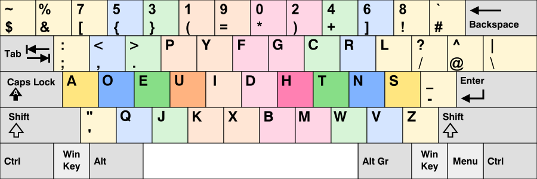

# ⌨️ Keyboard Layout Notice: Programmer’s Dvorak ⚡️

> ⚠️ **Heads up!** This setup uses the **Programmer's Dvorak** layout system-wide. If your keys feel “scrambled” — don’t worry, it’s intentional. 😉🎯

---

## 💡 What Is Programmer’s Dvorak? 🧠

**Programmer’s Dvorak** is a variant of the Dvorak keyboard layout designed specifically for programmers. It places symbols like `{ } [ ] ( )` and operators like `= + - * /` in more convenient locations, optimizing coding flow and reducing finger travel. 🚀💻

It’s different from:

* 🧠 **QWERTY** – Standard for most users.
* ✍️ **Dvorak** – Typing-optimized layout.
* 🔧 **Programmer’s Dvorak** – Typing **and** coding optimized.

This might feel a bit *"what the hell is this"* to newcomers. 😅

### 🖼️ Layout Preview



🔗 [Wikipedia: Programmer Dvorak](https://en.wikipedia.org/wiki/Keyboard_layout#Programmer_Dvorak)
🔗 [Visualizer: Keymap Drawer](https://keyboard-layout-editor.com/)

---

## 🛠️ How to Switch Back 🔄

If you're not used to it and just want your usual QWERTY back, here’s how to fix it:

### 🕶️ On NixOS

Edit your Home Manager config (usually `nixos/modules/xserver.nix`):

```nix
{
  services.xserver = {
    xkb.variant = "dvp"; # change this to "us" for QWERTY
  };
}
```

---

## 💻 Qtile Layout Indicator 🎛️

The bar uses a `KeyboardLayout` widget to toggle between layouts. Here's the relevant snippet from `home-manager/modules/desktop/qtile/src/config.py` (Line 405):

```python
    widget.KeyboardLayout(
        fmt="{} ",
        foreground=colors["base09"],
        configured_keyboards=["us dvp", "ge", "us"],  # remove "us dvp" to avoid Dvorak
        display_map={
            "us dvp": "DVP",
            "ge": "GE",
            "us": "US"
        },
        option="caps:escape",
        **powerline("back_slash"),
    ),
```

> 🔄 Use `Shift + Tab` to toggle layouts at runtime.   
> ✅ Default is DVP, but you can remove it from `configured_keyboards` if you want.

---

## 🧠 Heads-up ⚡️

* 🧹 **Caps Lock is Escape** via `option="caps:escape"` — change it if you want.  
* 🎛️ Both QWERTY and DVP layouts coexist for easy toggling and compatibility.

---

## 🧠 Why I Use It 🎯

* 🚀 Faster coding ergonomics
* 🧘‍♂️ Less finger strain & fatigue
* 😎 Feels hacker-core cool

Perfectly baked into my workflow, especially with modal editors like **Neovim**. 🔥

---

## 🪛 Changing It System-Wide (NixOS example) 🔧

Want to ditch DVP for good?

```nix
{
  services.xserver = {
    layout = "us";
    xkbVariant = ""; # empty string means default
  };
}
```

---

## 📌 TL;DR ⚡️

| Layout Seen         | Reaction    | What to Do         |
| ------------------- | ----------- | ------------------ |
| Programmer's Dvorak | 😰 Confused | Run `setxkbmap us` |
| Want to keep it?    | 😎 All good | Learn & enjoy      |

---

## 🧠 Resources to Learn 📚

* 📚 [TypingClub Dvorak Course](https://www.typingclub.com/sportal/program-3.game)
* 🎓 [Learn Dvorak / Programmer's Dvorak](https://learn.dvorak.nl/)
* ⌨️ [Keyboard Layout Editor](http://www.keyboard-layout-editor.com/)

---

> ⚠️ If you’re setting up this repo, **this layout is active by default.** You’ve been warned. 🫡
> Happy typing! 🐧✨

---
