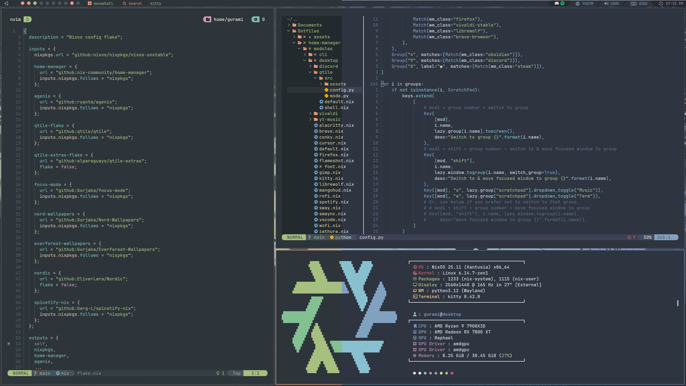
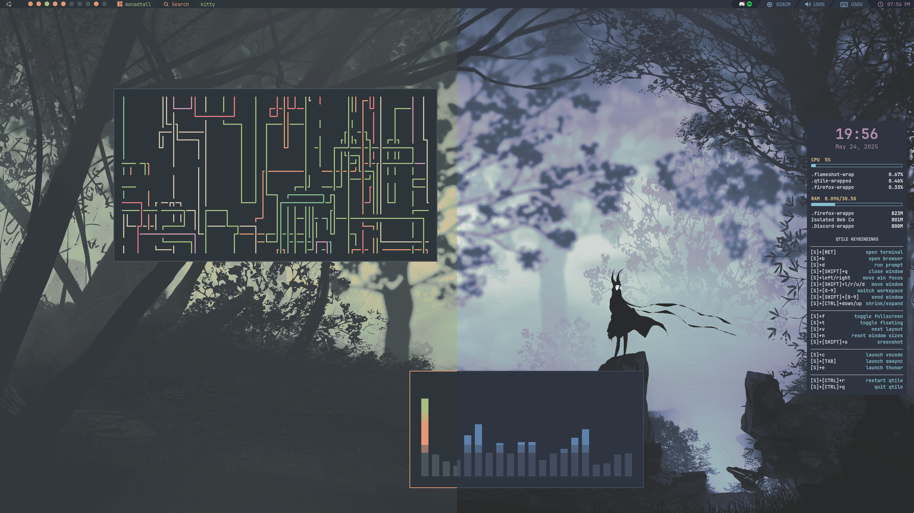
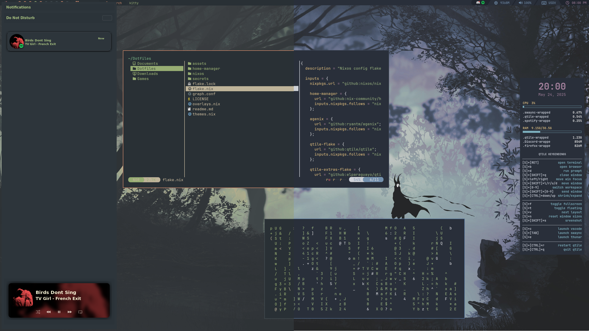
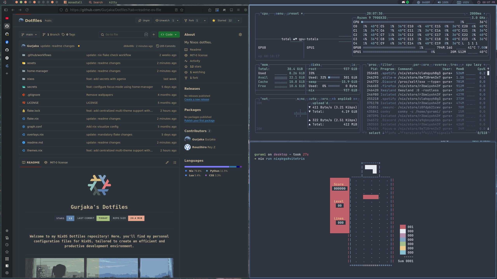

<div align="center">


# <samp>Gurjaka's Dotfiles</samp>


---

### <samp>Welcome to my NixOS Dotfiles repository! Here, you'll find my personal configuration files for NixOS, tailored to create an efficient and productive development environment.</samp>

---

<p align="center">
<a href="https://gurjaka.github.io/Dotfiles/" target="_blank">📚 View Documentation</a>
</p>

---



</div>

## <samp>🔧 Installation</samp>

### ❄️  <samp>NixOS</samp>
`I` Clone the repository in home directory: 
```bash
git clone https://github.com/Gurjaka/Dotfiles.git ~/
```

`II` Modify flake.nix to set Hostname, Username, and Drivers in `~/Dotfiles/flake.nix`

> Note: Don't forget to edit the appropriate settings such as username & hardware configuration
> You can use `cp /etc/nixos/hardware-configuration.nix ~/Dotfiles/nixos/`

`III` Rebuild your system (Change HOSTNAME/USERNAME): 
```bash
sudo nixos-rebuild switch --flake ~/Dotfiles#HOSTNAME # Apply system configuration

# Apply home configuration
nix run home-manager -- switch --flake ~/Dotfiles#USERNAME
```

> Note: If your browser of choice is Vivaldi, you need to open Vivaldi atleast once to generate it's settings, and rebuild afterwards in order to apply preconfigured settings

## 📑 <samp>DETAILS</samp>

### <samp>🛠️ System</samp>



- Linux Kernel: [Zen](https://github.com/zen-kernel/zen-kernel)
- Desktop Environment: [Qtile](http://www.qtile.org)
- Terminal Emulator: [Foot](https://codeberg.org/dnkl/foot) and [Ghostty](https://ghostty.org/)
- Shell: [Fish](https://fishshell.com/) and [Zsh](https://www.zsh.org/)
- Compositor: [Qtile Wayland](https://docs.qtile.org/en/stable/manual/wayland.html)
- Notifier: [SwayNC](https://github.com/ErikReider/SwayNotificationCenter)

### <samp>Dev</samp>


- Browser: [Firefox](https://www.firefox.com/en-US/)
- GUI Text Editor: [VSCode](https://code.visualstudio.com/)
- TUI Text Editor: [Neovim](https://neovim.io/)
- TUI Commit Helper: [Lazygit](https://github.com/jesseduffield/lazygit)

### <samp>Other Utilities</samp>

- TUI File manager: [Yazi](https://yazi-rs.github.io/)
- GUI File manager: [Thunar](https://docs.xfce.org/xfce/thunar/start)
- Resource monitor: [Btop](https://github.com/aristocratos/btop)
- screenshot tool: [Flameshot](https://flameshot.org)



## 🎨 <samp>Colors</samp>

<table align="center">
<br><br><br><br><br><br><br>
  <tr>
    <td align="center">
      <samp>
        This configuration blends the <a href="https://www.nordtheme.com/">❄️ Nord</a>
        theme's icy calmness with the earthy tones of <a href="https://github.com/sainnhe/everforest">🌲 Everforest</a>.
      </samp>
    </td>
  </tr>
</table>

<div align="center">
  <table>
    <tr>
      <td align="center">
        <a href="https://www.nordtheme.com/docs/colors-and-palettes" target="_blank">
          
        </a>
        <p><samp>Nord Palette</samp></p>
      </td>
      <td align="center">
      <br><br><br><br>
        <a href="https://github.com/sainnhe/everforest" target="_blank">
          
        </a>
        <p><samp>Everforest Palette</samp></p>
      </td>
    </tr>
  </table>
</div>

<p align="center">
  <picture>
    <source srcset="https://raw.githubusercontent.com/nordtheme/assets/main/static/images/elements/separators/iceberg/footer/dark/spaced.svg?sanitize=true" width="100%" media="(prefers-color-scheme: light), (prefers-color-scheme: no-preference)" />
    <source srcset="https://raw.githubusercontent.com/nordtheme/assets/main/static/images/elements/separators/iceberg/footer/light/spaced.svg?sanitize=true" width="100%" media="(prefers-color-scheme: dark)" />
    
  </picture>
</p>
